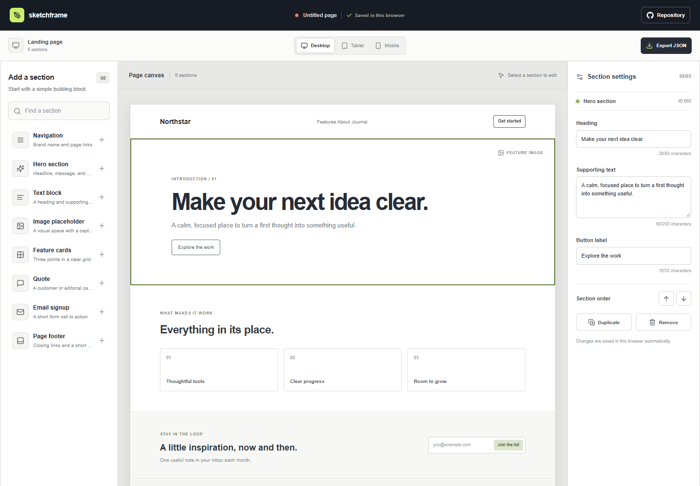

# Wireframe Playground

Sketchframe is a browser-based page planning tool for arranging common website sections and editing their sample content. It is intended for people who want to explore a page structure before moving into a design or development tool.

**Live site:** [https://a2rp.github.io/wireframe-playground/](https://a2rp.github.io/wireframe-playground/)

## What is included

- A fixed studio header with a link to the public source repository.
- A searchable section library with navigation, hero, text, image placeholder, feature cards, quote, email signup, and footer blocks.
- A page canvas that renders each section as a simple wireframe. Click or keyboard-select a section to edit it.
- A responsive viewport switcher for desktop, tablet, and mobile previews.
- An inspector for changing a section heading, supporting text, and button label when that section uses one. The character limits are shown beside each field.
- Section order controls, duplication, and a custom confirmation dialog before a selected section is removed.
- Automatic local saving and an **Export JSON** download with the current sections and selected viewport.
- A shared footer with project, profile, and support links, and a floating **Back to top** control after scrolling.

## How to use it

Choose a block from **Add a section** to append it to the canvas. Select a section on the canvas to open its settings. Edit the text in the inspector, move the section with the order arrows, or make a copy. Remove opens a confirmation dialog; choosing **Keep section**, clicking outside the dialog, or pressing Escape leaves the page unchanged. Confirming removes only the selected section.

Use the viewport buttons to preview the layout at desktop, tablet, or mobile width. **Export JSON** downloads `sketchframe-wireframe.json` with the page sections, selected viewport, and export time. The file can be used as a content outline; the app does not generate production HTML or CSS.

## Saving and limits

The current layout is stored in this browser's local storage under `sketchframe-wireframe-v1`. No account or server is used. Changes remain in the same browser profile after reload, but they are not synchronized across devices. Clearing site data removes the saved layout. A fresh browser starts with the example landing page. The heading is limited to 80 characters, supporting text to 200 characters, and button labels to 32 characters. Image sections are visual placeholders and do not upload or store image files.

## Run locally

Use Node.js and npm, then run these commands from this directory:

```sh
npm install
npm run dev
```

## Checks and deployment

```sh
npm run lint
npm run build
npm run deploy
```

The deploy command builds the app and publishes `dist` to the `gh-pages` branch. Vite uses `/wireframe-playground/` as its GitHub Pages base path.

## Future improvements

These are ideas and are not implemented yet:

- Add drag-and-drop ordering and saved page templates.
- Export a styled HTML and CSS starter alongside the JSON outline.
- Allow users to add images and choose from more section variants.
- Add named projects and import for previously exported wireframes.

## Links

- Portfolio: [https://www.ashishranjan.net](https://www.ashishranjan.net)
- GitHub: [https://github.com/a2rp](https://github.com/a2rp)
- CodePen: [https://codepen.io/ash1198](https://codepen.io/ash1198)
- LinkedIn: [https://www.linkedin.com/in/aashishranjan](https://www.linkedin.com/in/aashishranjan)
- Facebook: [https://www.facebook.com/theash.ashish/](https://www.facebook.com/theash.ashish/)
- YouTube: [https://www.youtube.com/@ashishranjan-ashz?sub_confirmation=1](https://www.youtube.com/@ashishranjan-ashz?sub_confirmation=1)
- Email: [mailto:ash.ranjan09@gmail.com](mailto:ash.ranjan09@gmail.com)

## Support

- Support: [https://a2rp-donation-page.netlify.app/](https://a2rp-donation-page.netlify.app/)
- Buy Me a Coffee: [https://buymeacoffee.com/ashishranjan](https://buymeacoffee.com/ashishranjan)
- Patreon: [https://www.patreon.com/ashishranjan](https://www.patreon.com/ashishranjan)
